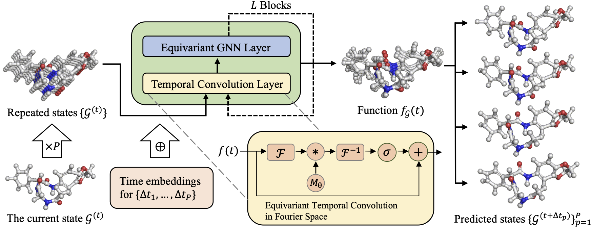

# Equivariant Graph Neural Operator for Modeling 3D Dynamics


[](https://github.com/MinkaiXu/EGNO/blob/main/LICENSE)
[](https://arxiv.org/abs/2401.11037)

This repository contains the official implementation of our [Equivariant Graph Neural Operator](https://arxiv.org/abs/2401.11037).

> [**Equivariant Graph Neural Operator for Modeling 3D Dynamics**](https://arxiv.org/abs/2401.11708)   
> Minkai Xu*, Jiaqi Han*, Aaron Lou, Jean Kossaifi, Arvind Ramanathan, Kamyar Azizzadenesheli, Jure Leskovec, Stefano Ermon, Anima Anandkumar
> <br>**Stanford University, NVIDIA, Argonne National Laboratory, California Institute of Technology**<br>



## Environment

You can install the exact environment with `env.yml`:

```bash
conda env create -f env.yml
```

or manually install the following packages:

```
python=3.8.17
pytorch=2.0.1
scipy=1.10.1
```
You may also need `mdanalysis` if you want to process the protein MD data.


## Data Preparation

**1. Simulation dataset**

We provide the data preprocessing code in `simulation/dataset`. One can simply run

```python
cd simulation/dataset
python -u generate_dataset.py
```

**2. Motion capture dataset**

We provide our pre-processed dataset as well as the splits in `motion/dataset` folder.

**3. MD17 dataset**

We provide the splits in `md17` folder. The dataset can be downloaded from [here](http://www.sgdml.org/#datasets) and then placed in `md17` folder.

**4. Protein MD**

We provide the data preprocessing code in `mdanalysis/preprocess.py`. One can simply run

```python
python mdanalysis/preprocess.py
```

after setting the correct data path specified as the variable `tmp_path` in `preprocess.py`.


## Train the EGNO

**1. Simulation dataset**

```bash
python -u main_simulation_simple_no.py --config_by_file --outf $log_dir
```

**2. Motion capture**

```bash
python -u main_mocap_no.py --config_by_file --outf $log_dir
```

**3. MD17**

```bash
python -u main_md17_no.py --config_by_file --outf $log_dir
```

**4. Protein MD**

```bash
python -u main_mdanalysis_no.py --config_by_file --outf $log_dir
```


## Evaluation

All evaluations (validation and testing) are conducted along with training.

## Citation

Please consider citing the our paper if you find it helpful. Thank you!

```
@article{xu2024equivariant,
  title={Equivariant Graph Neural Operator for Modeling 3D Dynamics},
  author={Xu, Minkai and Han, Jiaqi and Lou, Aaron and Kossaifi, Jean and Ramanathan, Arvind and Azizzadenesheli, Kamyar and Leskovec, Jure and Ermon, Stefano and Anandkumar, Anima},
  journal={arXiv preprint arXiv:2401.11037},
  year={2024}
}
```

## Contact

If you have any question, welcome to contact me at:

Minkai Xu: minkai@cs.stanford.edu

## Acknowledgement

This repo is built upon several great codebases, including [EGNN](https://github.com/vgsatorras/egnn) and [GMN](https://github.com/hanjq17/GMN). We thank the authors for their great work and open-sourcing the code!
